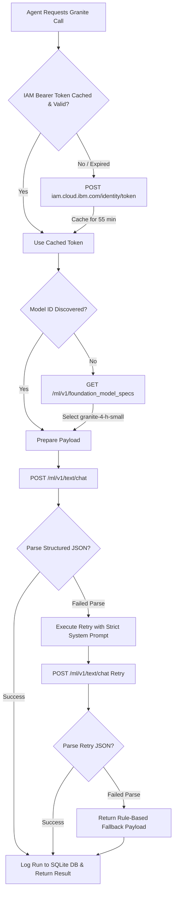
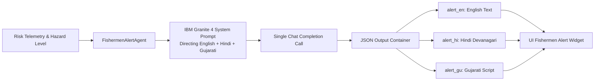
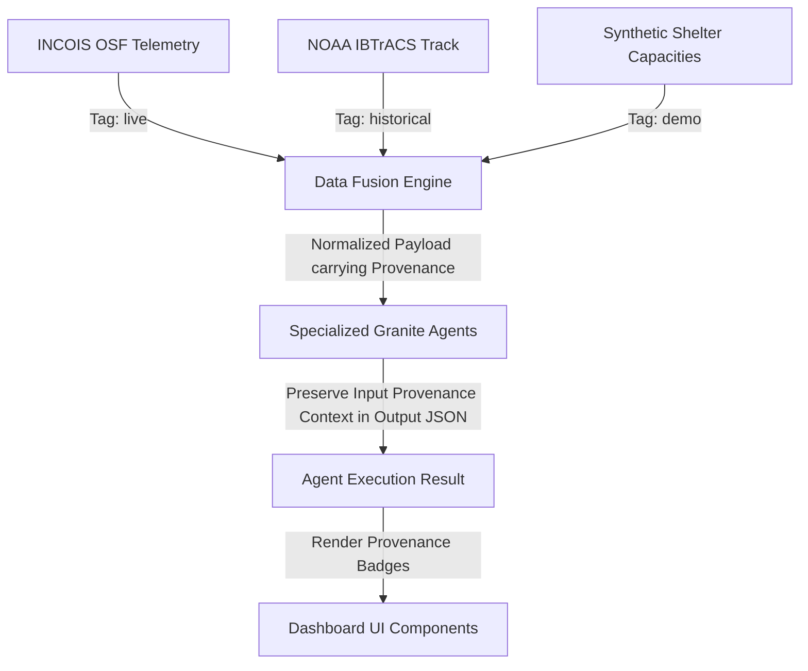

# 🤖 SafeSurge AI — Agent Architecture & Engineering Specification

> **Six specialized agents. One coordinated disaster intelligence pipeline.**

SafeSurge AI intentionally rejects the pattern of relying on a single monolithic LLM prompt to analyze an entire disaster scenario. 

Instead, SafeSurge implements a **multi-agent orchestration architecture** where each agent possesses a strictly bounded domain of responsibility, deterministic input/output contracts, and transparent data provenance handling.

---

# 🗺️ Agent System Topology

```mermaid
flowchart TD
    subgraph Trigger_Group ["Trigger"]
        EOC["Command Center UI / API Call"]
    end

    subgraph Data_Injection ["Data Injection"]
        DFE["dataFusionEngine.js"] -->|Normalized Scenario JSON| AGENT1
    end

    subgraph Step_1 ["Step 1: Hazard Assessment"]
        AGENT1["1. Cyclone Interpretation Agent<br/>/api/agents/interpret-risk"]
    end

    subgraph Step_2 ["Step 2: Concurrent Operations (Parallel)"]
        AGENT2["2. Fishermen Safety Alert Agent<br/>/api/agents/fishermen-alert"]
        AGENT3["3. Evacuation Planning Agent<br/>/api/agents/evacuation-plan"]
    end

    subgraph Step_3 ["Step 3: Logistics Dependencies"]
        AGENT4["4. Relief Coordination Agent<br/>/api/agents/relief-coordination"]
    end

    subgraph Step_4 ["Step 4: Executive Synthesis"]
        AGENT6["6. Command Orchestrator Agent<br/>/api/orchestrator/run-full-chain"]
    end

    subgraph Standalone_Ops ["Standalone Operations"]
        AGENT5["5. Damage Assessment Agent<br/>/api/agents/damage-assessment"]
    end

    EOC --> RUNC["POST /api/orchestrator/run-full-chain"]
    RUNC --> DFE
    AGENT1 -->|Risk Level & Zones| AGENT2
    AGENT1 -->|Risk Level & Zones| AGENT3
    AGENT3 -->|Evacuation Priorities| AGENT4
    AGENT1 -->|Interpretation Output| AGENT6
    AGENT2 -->|Trilingual Alerts| AGENT6
    AGENT3 -->|Evacuation Plan| AGENT6
    AGENT4 -->|Resource Demands| AGENT6
    AGENT6 -->|Unified Briefing| EOC

    style AGENT1 fill:#1e293b,stroke:#3b82f6,stroke-width:2px
    style AGENT2 fill:#1e293b,stroke:#22c55e,stroke-width:2px
    style AGENT3 fill:#1e293b,stroke:#eab308,stroke-width:2px
    style AGENT4 fill:#1e293b,stroke:#ec4899,stroke-width:2px
    style AGENT6 fill:#1e293b,stroke:#a855f7,stroke-width:2px
    style AGENT5 fill:#1e293b,stroke:#64748b,stroke-width:2px
```



---

# 📋 Agent Responsibility Matrix

| Agent Name | Primary Responsibility | Foundation Model | Execution Topology | Inputs | Outputs |
| :--- | :--- | :--- | :--- | :--- | :--- |
| **1. Cyclone Interpretation** | Classifies coastal risk levels (`LOW` → `CRITICAL`) from environmental metrics | `ibm/granite-4-h-small` | Step 1 (Sequential) | Wind speed, wave height, pressure, track distance | Risk level, affected coastal zones, key physical factors |
| **2. Fishermen Safety Alert** | Generates urgent safety advisories in English, Hindi, and Gujarati | `ibm/granite-4-h-small` | Step 2 (Parallel with Evacuation) | Risk level, wind speed, wave height, affected zones | Alert level (`RED`/`EXTREME_RED`), trilingual text guidance, boat recall flag |
| **3. Evacuation Planning** | Ranks coastal settlements by vulnerability and shelter gap | `ibm/granite-4-h-small` | Step 2 (Parallel with Fishermen Alert) | Risk level, settlement population, elevation, exposure | Ranked settlement list, priority tiers (`IMMEDIATE`/`URGENT`), shelter gap |
| **4. Relief Coordination** | Computes 72h emergency supply demands (food, water, medical, boats) | `ibm/granite-4-h-small` | Step 3 (Sequential after Evacuation) | Evacuation plan, total population, shelter capacity | Food packets, water liters, medical teams, rescue boats needed |
| **5. Damage Assessment** | Scores post-disaster structural damage from text reports | `ibm/granite-4-h-small` | Standalone (On-demand) | Location, structural description, structure type | Damage tier, score (0-100), immediate needs, search & rescue flag |
| **6. Command Orchestrator** | Synthesizes all specialist agent outputs into an EOC briefing | `ibm/granite-4-h-small` | Step 4 (Sequential Final) | Outputs from Agents 1, 2, 3, & 4 + scenario conditions | Executive summary, immediate priorities, coordination status |

---

# 🔗 Agent Dependency Graph

```mermaid
graph TD
    CONDITIONS["Environmental Conditions / Data Fusion"] --> A1["1. Cyclone Interpretation Agent"]
    
    A1 -->|Risk Level: HIGH/CRITICAL| A2["2. Fishermen Alert Agent"]
    A1 -->|Risk Level: HIGH/CRITICAL| A3["3. Evacuation Planning Agent"]
    SETTLEMENTS["Settlements Reference DB"] --> A3
    
    A3 -->|Evacuation Plan Payload| A4["4. Relief Coordination Agent"]
    
    A1 -->|Risk Summary| A6["6. Command Orchestrator Agent"]
    A2 -->|Fishermen Alert Payload| A6
    A3 -->|Evacuation Plan Payload| A6
    A4 -->|Relief Requirements Payload| A6
    
    A6 --> OUTPUT_NODE["Unified EOC Dashboard Response"]

    style A1 fill:#0f172a,stroke:#3b82f6,stroke-width:2px
    style A2 fill:#0f172a,stroke:#22c55e,stroke-width:2px
    style A3 fill:#0f172a,stroke:#eab308,stroke-width:2px
    style A4 fill:#0f172a,stroke:#ec4899,stroke-width:2px
    style A6 fill:#0f172a,stroke:#a855f7,stroke-width:2px
```



---

# 📜 Detailed Agent Contracts

### 1. Cyclone Track & Intensity Interpretation Agent
- **File**: `backend/agents/cycloneInterpretationAgent.js`
- **Endpoint**: `POST /api/agents/interpret-risk`
- **Single Responsibility**: Interpret authoritative physical telemetry (wind, wave, surface pressure MSLP proxy, storm distance). **Never** forecast future storm tracks or generate meteorological models.
- **Constraints**:
  - Risk thresholds: `wind > 157 km/h` OR `wave > 8m` → `CRITICAL`; `wind > 120 km/h` OR `wave > 6m` → `HIGH`; `wind > 75 km/h` OR `wave > 3.5m` → `MODERATE`; else `LOW`.
  - Distance heuristic: `< 200 km` from Gujarat coast → automatically flag Kutch/Saurashtra in `affected_zones`.
- **Input Schema**:
```json
{
  "wind_speed_kmh": 157.0,
  "wave_height_m": 8.0,
  "pressure_hpa": 950.0,
  "category": "Extremely Severe Cyclonic Storm",
  "distance_from_gujarat_km": 100.0,
  "timestamp": "2023-06-14T12:00:00Z",
  "provenance": "historical"
}
```
- **Output Schema**:
```json
{
  "risk_level": "CRITICAL",
  "affected_zones": ["Kutch Coast", "Saurashtra Coast"],
  "factors": ["Wind speeds exceeding 150 km/h", "Severe wave height > 8m", "Pressure drop to 950 hPa"],
  "recommended_actions": ["Issue immediate fishermen recall", "Activate Kutch district EOC"],
  "confidence": 0.92,
  "uncertainty": "Track speed variations could shift landfall timing by +/- 3 hours.",
  "interpretation_summary": "Extremely severe cyclonic storm approaching Kutch coast within 24 hours.",
  "provenance": "historical",
  "data_note": "AI interpretation of source data — not an original meteorological forecast."
}
```

---

### 2. Fishermen Safety Alert Agent
- **File**: `backend/agents/fishermenAlertAgent.js`
- **Endpoint**: `POST /api/agents/fishermen-alert`
- **Single Responsibility**: Convert risk assessment into immediate, actionable safety advisories in **three languages simultaneously** (English, Hindi Devanagari script, Gujarati script).
- **Constraints**:
  - Must use actual Unicode script for Hindi (Devanagari) and Gujarati (Gujarati script) — **no transliteration**.
  - For `CRITICAL` risk: `boat_recall = true`, `port_closure_advised = true`, `alert_level = EXTREME_RED`.
- **Output Schema Sample** *(Scenario: Historical Replay)*:
```json
{
  "alert_level": "EXTREME_RED",
  "alert_en": {
    "headline": "URGENT: High Seas Warning — Return to Port Immediately",
    "body": "Severe cyclonic conditions are approaching the Gujarat coast. Wind speeds exceed safe navigation thresholds.",
    "fishing_advice": "DO NOT venture into the sea. All boats must return to port immediately."
  },
  "alert_hi": {
    "headline": "अत्यावश्यक: उच्च समुद्री चेतावनी — तुरंत बंदरगाह लौटें",
    "body": "गुजरात तट पर भीषण चक्रवाती स्थिति आ रही है। हवा की गति सुरक्षित नेविगेशन सीमा से अधिक है।",
    "fishing_advice": "समुद्र में मत जाइए। सभी नावें तुरंत बंदरगाह लौटें।"
  },
  "alert_gu": {
    "headline": "તાત્કાલિક: ઊંચા સમુદ્રની ચેતવણી — તત્કાળ બંદર પર પાછા ફરો",
    "body": "ગુજરાત દરિયાકિનારે ભારે વાવાઝોડાની સ્થિતિ સર્જાઈ છે. તમામ માછીમારી નૌકાઓ તરત જ બંદર પર પાછી ફરે.",
    "fishing_advice": "દરિયામાં ન જશો. તમામ નૌકાઓ તરત બંદર પર પાછી ફરે."
  },
  "boat_recall": true,
  "port_closure_advised": true,
  "confidence": 0.95,
  "provenance": "historical"
}
```

---

### 3. Evacuation Route & Priority Planning Agent
- **File**: `backend/agents/evacuationAgent.js`
- **Endpoint**: `POST /api/agents/evacuation-plan`
- **Single Responsibility**: Rank coastal settlements by vulnerability to determine evacuation priorities and compute shelter deficits.
- **Constraints**:
  - `IMMEDIATE` priority (Red): `coastal_exposure = extreme` AND `risk >= HIGH`.
  - `URGENT` priority (Orange): `coastal_exposure = very_high` OR (`risk = CRITICAL` with exposure = `high`).
  - Calculate `shelter_gap = shelter_capacity - population_to_evacuate` (negative value indicates shortfall).
- **Output Schema**:
```json
{
  "evacuation_priorities": [
    {
      "rank": 1,
      "settlement_id": "jakhau",
      "settlement_name": "Jakhau",
      "priority_tier": "IMMEDIATE",
      "priority_color": "red",
      "population_to_evacuate": 12000,
      "shelter_gap": -7000,
      "reasoning": "Landfall target point with extreme coastal exposure and low elevation.",
      "route_advice": "Evacuate inland along State Highway 89 towards Naliya.",
      "provenance": "historical"
    }
  ],
  "total_evacuation_population": 485000,
  "total_shelter_capacity": 310000,
  "overall_shelter_deficit": -175000,
  "timing_window_hours": 18,
  "disclaimer": "AI-generated recommendation only — not an official government evacuation order."
}
```

---

### 4. Relief Resource Coordination Agent
- **File**: `backend/agents/reliefCoordinationAgent.js`
- **Endpoint**: `POST /api/agents/relief-coordination`
- **Single Responsibility**: Compute 72-hour supply logistics and mobilization requirements based on evacuation rankings.
- **Constraints**:
  - `food_packets_72h = total_people * 3 meals/day * 3 days = total_people * 9`
  - `water_liters_72h = total_people * 5 liters/day * 3 days = total_people * 15`
  - `medical_teams_needed = ceil(total_people / 5000)`
  - `rescue_boats_needed = ceil(IMMEDIATE_tier_population / 500)`
- **Output Schema**:
```json
{
  "resource_summary": {
    "total_people_needing_shelter": 485000,
    "available_shelter_capacity": 310000,
    "shelter_deficit": 175000,
    "critical_shortage_locations": ["Jakhau", "Mandvi"]
  },
  "resource_requirements": {
    "relief_camps_needed": 88,
    "food_packets_72h": 4365000,
    "water_liters_72h": 7275000,
    "medical_teams_needed": 97,
    "rescue_boats_needed": 140,
    "ambulances_needed": 243
  },
  "mobilization_actions": [
    {
      "priority": "HIGH",
      "action": "Deploy 12 NDRF battalions to Kutch staging areas",
      "responsible_agency": "NDRF / District Collector",
      "timeline_hours": 6
    }
  ],
  "provenance": "historical"
}
```

---

### 5. Post-Disaster Damage Assessment Agent
- **File**: `backend/agents/damageAssessmentAgent.js`
- **Endpoint**: `POST /api/agents/damage-assessment`
- **Single Responsibility**: Score post-disaster structural damage reports submitted via text descriptions.
- **Model Limitation Disclosure**: `VISION_CAPABLE = false`. Deployed model (`ibm/granite-4-h-small`) does not support image analysis. Operates strictly on structured text descriptions and is clearly labeled as *AI-Generated Text Analysis*.
- **Output Schema**:
```json
{
  "damage_tier": "SEVERE",
  "damage_score": 75,
  "structural_assessment": "Major roof collapse and severe coastal flooding reported at Mandvi port buildings.",
  "immediate_needs": ["Emergency roof tarps", "Dewatering pumps", "Structural safety audit"],
  "search_rescue_required": false,
  "medical_emergency": true,
  "estimated_repair_timeline": "4-6 weeks",
  "confidence": 0.82,
  "assessment_basis": "Text description analysis",
  "_vision_capable": false,
  "disclaimer": "AI damage assessment based on reported description only — not a certified structural survey."
}
```

---

### 6. Command Orchestrator Agent
- **File**: `backend/agents/commandOrchestrator.js`
- **Endpoint**: `POST /api/orchestrator/run-full-chain`
- **Single Responsibility**: Synthesize outputs from Agents 1–4 into an executive EOC briefing.
- **Output Schema**:
```json
{
  "command_summary": "Extremely Severe Cyclonic Storm approaching Kutch coast. Boat recall enforced across all ports. Immediate evacuation underway for 485,000 residents across 6 coastal settlements with a 175,000 shelter deficit.",
  "overall_threat_level": "CRITICAL",
  "immediate_priorities": [
    "Enforce complete fishing vessel recall at Jakhau & Mandvi ports",
    "Evacuate IMMEDIATE-tier populations in Jakhau and Mandvi to inland shelters",
    "Deploy 12 NDRF battalions with dewatering equipment to Kutch"
  ],
  "coordination_status": {
    "fishermen_alert_sent": true,
    "evacuation_ordered": true,
    "relief_mobilized": true,
    "coast_guard_alerted": true
  },
  "time_to_impact_estimate": "18-24 hours",
  "confidence": 0.91,
  "provenance": "historical"
}
```

---

# ⏱️ Runtime Execution Pipeline

```mermaid
sequenceDiagram
    autonumber
    actor Commander as "EOC Commander (UI)"
    participant Express as "Express Router (/api/orchestrator)"
    participant Orch as "commandOrchestrator.js"
    participant DFE as "dataFusionEngine.js"
    participant Granite as "graniteClient.js"
    participant WX as "IBM watsonx.ai (Granite 4)"
    participant DB as "SQLite (safesurge.db.bin)"

    Commander->>Express: POST /api/orchestrator/run-full-chain
    Express->>Orch: runFullChain(conditions, settlements)
    Orch->>DFE: getLatestConditions()
    DFE-->>Orch: Return Normalized Scenario + Provenance

    rect rgb(30, 41, 59)
        note over Orch,WX: Step 1: Cyclone Risk Interpretation
        Orch->>Granite: callGranite('CycloneInterpretation', prompt, input)
        Granite->>WX: POST /ml/v1/text/chat (Bearer Token)
        WX-->>Granite: JSON Response (Choices)
        Granite->>DB: logAgentRun('CycloneInterpretation', ...)
        Granite-->>Orch: Risk Output (CRITICAL)
    end

    rect rgb(15, 23, 42)
        note over Orch,WX: Step 2: Concurrent Execution (Promise.all)
        par Fishermen Alert Agent
            Orch->>Granite: callGranite('FishermenAlert', prompt, risk)
            Granite->>WX: POST /ml/v1/text/chat
            WX-->>Granite: Trilingual Alerts JSON
            Granite->>DB: logAgentRun('FishermenAlert', ...)
            Granite-->>Orch: Alert Output
        and Evacuation Agent
            Orch->>Granite: callGranite('EvacuationPlanning', prompt, risk+settlements)
            Granite->>WX: POST /ml/v1/text/chat
            WX-->>Granite: Evacuation Priorities JSON
            Granite->>DB: logAgentRun('EvacuationPlanning', ...)
            Granite-->>Orch: Evacuation Output
        end
    end

    rect rgb(30, 41, 59)
        note over Orch,WX: Step 3: Dependent Relief Coordination
        Orch->>Granite: callGranite('ReliefCoordination', prompt, evacuationOutput)
        Granite->>WX: POST /ml/v1/text/chat
        WX-->>Granite: Relief Logistics JSON
        Granite->>DB: logAgentRun('ReliefCoordination', ...)
        Granite-->>Orch: Relief Output
    end

    rect rgb(15, 23, 42)
        note over Orch,WX: Step 4: Executive Command Synthesis
        Orch->>Granite: callGranite('CommandOrchestrator', prompt, allOutputs)
        Granite->>WX: POST /ml/v1/text/chat
        WX-->>Granite: Executive Summary JSON
        Granite->>DB: logAgentRun('CommandOrchestrator', ...)
        Granite-->>Orch: Command Summary Output
    end

    Orch-->>Express: Complete Unified Chain Payload + Latencies
    Express-->>Commander: 200 OK (Render Dashboard)
```



---

# 🧠 Granite 4 Client & Retry Mechanics

All agent interactions flow through `backend/services/graniteClient.js`.



---

# 🗣️ Multilingual Alert Pipeline



---

# 🛡️ Data Provenance Propagation



---

# ⚠️ Failure Modes & Recovery Matrix

| Failure Mode | Detection Mechanism | Recovery Strategy | User-Visible Result |
| :--- | :--- | :--- | :--- |
| **INCOIS Endpoint Timeout** | Request timeout > 5000ms in `incoisAdapter.js` | Fall back to historical Biparjoy dataset (`dataFusionEngine.js`) | Header displays **🔵 HISTORICAL REPLAY — Biparjoy 2023** badge. |
| **Open-Meteo MSLP Failure** | Network exception or HTTP 5xx | Set `pressure_hpa` to `null` with provenance `demo` | Pressure field displays `N/A` with yellow DEMO badge. |
| **watsonx IAM Auth Error** | 401 Unauthorized from IAM token endpoint | Log error and trigger deterministic fallback | Dashboard displays rule-based fallback assessment with warning banner. |
| **Granite Malformed JSON** | `parseStructuredResponse` fails regex & `JSON.parse` | Send 1-shot retry prompt with strict JSON directive | Successfully parsed retry output is returned seamlessly. |
| **Granite Retry Failure** | Second parse attempt returns invalid JSON | Inject deterministic fallback payload with matching provenance | Output rendered with disclaimer note: *AI fallback response active*. |

---

# 📐 Core Agent Architecture Design Principles

1. **One Agent → One Bounded Responsibility**: Agents never cross operational domains. Cyclone interpretation never calculates food packets.
2. **Authoritative Data Ingestion**: The LLM is an interpreter and contextualizer, never the primary source of weather forecasts.
3. **Transparent Data Provenance**: Every data field explicitly preserves its origin tag (`live`, `historical`, or `demo`) through all transformation layers.
4. **Resilient Fallback Design**: Failure is treated as an explicit system state. The application degrades gracefully without crashing.
5. **No Unsupported Claims**: Capabilities are documented with total honesty (e.g. text-based damage assessment due to lack of model vision).
