# 🧭 SafeSurge AI — Architecture & Engineering Decisions

> **This document explains WHY SafeSurge AI is built the way it is.**

Every design choice in SafeSurge AI—from database engine selection to multi-agent execution topology—was made to satisfy three non-negotiable hackathon and real-world engineering constraints:

1. **Absolute Technical Honesty**: AI must never hallucinate weather forecasts or disguise static data as live telemetry.
2. **Zero-Friction Deployment**: The platform must launch instantly on any Windows laptop without native compilation steps or complex database setups.
3. **Resilient Demonstration Quality**: External API timeouts (INCOIS, watsonx) must cause graceful degradation, never system crashes.

---

# 🗺️ Architecture Decision Map

```mermaid
flowchart TD
    subgraph Drivers ["Engineering Drivers"]
        D1["Coastal Disaster Risk in Gujarat"]
        D2["Need for Verifiable Trust & Speed"]
        D3["Venue Deployment Constraints"]
    end

    subgraph Architectural_Choices ["Core Engineering Decisions"]
        ADR1["ADR-001: Multi-Agent Pipeline"]
        ADR2["ADR-002: IBM Granite 4 via Chat API"]
        ADR3["ADR-004: INCOIS THREDDS Ocean Telemetry"]
        ADR4["ADR-005: Open-Meteo Atmospheric Pressure"]
        ADR5["ADR-007: Explicit 3-Tier Data Provenance"]
        ADR6["ADR-010: WebAssembly SQLite Database"]
    end

    subgraph Operational_Outcomes ["System Capabilities"]
        O1["Hyperlocal Risk Reasoning"]
        O2["Trilingual Fishermen Alerts"]
        O3["Prioritized Evacuation & Relief Logistics"]
        O4["Zero-Native Build 1-Click Launch"]
    end

    D1 --> ADR1
    D1 --> ADR3
    D2 --> ADR2
    D2 --> ADR5
    D3 --> ADR3
    D3 --> ADR6

    ADR1 --> O1
    ADR1 --> O2
    ADR1 --> O3
    ADR2 --> O1
    ADR3 --> O1
    ADR4 --> O1
    ADR5 --> O2
    ADR6 --> O4

    style ADR1 fill:#1e293b,stroke:#3b82f6,stroke-width:2px
    style ADR2 fill:#1e293b,stroke:#052FAD,stroke-width:2px
    style ADR5 fill:#1e293b,stroke:#22c55e,stroke-width:2px
```

---

# 📚 Architecture Decision Records (ADRs)

### ADR-001 — Multi-Agent Pipeline vs Monolithic Prompt
- **Status**: Accepted
- **Context**: Disaster response requires evaluating physical risks, writing emergency alerts, ordering village evacuations, and computing food/water logistics.
- **Problem**: Passing all tasks to a single LLM prompt leads to hallucinated numbers, skipped instructions, and unacceptably long completion latencies.
- **Decision**: Architect 6 specialized, single-responsibility agents running in a hybrid execution topology (sequential hazard assessment → concurrent alerts & evacuation → dependent relief logistics → final command briefing).
- **Alternatives Considered**: Monolithic single-prompt evaluation, traditional rule-based expert systems without AI.
- **Trade-offs**: Increases backend orchestration logic complexity, but improves JSON schema adherence and provides predictable failure handling.

---

### ADR-002 — IBM Granite 4 & watsonx.ai Chat API Integration
- **Status**: Accepted
- **Context**: IBM watsonx.ai provides foundation models via foundation model specs APIs.
- **Decision**: Select `ibm/granite-4-h-small` via the `/ml/v1/text/chat` endpoint (Chat Completions API) with auto-discovery and in-memory IAM token caching (55-minute TTL).
- **Why**: Granite 4 offers superior instruction-following for structured JSON outputs compared to legacy text generation endpoints. Token caching reduces auth overhead from ~400ms per agent call to 0ms for cached invocations.
- **Reconsideration Trigger**: Availability of multimodal vision-capable Granite models on watsonx.

---

### ADR-003 — Node.js + Express Backend vs Python FastAPI
- **Status**: Accepted
- **Context**: The venue execution environment runs Node.js v24.
- **Decision**: Build the backend using Node.js v24 and Express, executing watsonx HTTP calls via Node's native `https` client.
- **Why**: Avoids python virtual environment creation, `pip install` permission issues, and C-extension compilation delays during venue bat-file execution.

---

### ADR-004 — INCOIS THREDDS WMS as Primary Ocean State Source
- **Status**: Accepted
- **Context**: The Indian National Centre for Ocean Information Services (INCOIS) provides authoritative ocean state forecasts for the Arabian Sea.
- **Decision**: Ingest live Significant Wave Height (SWH), Wind Speed Magnitude (WSM), Wind Direction, Sea Surface Temperature (SST), and Surface Currents from INCOIS THREDDS WMS endpoints (`osf/ww3`, `osf/winds`).
- **Offshore Coordinate Selection**: Query `20.5° N, 68.5° E` (Gujarat Sea Area), ~130 km offshore from Porbandar. This coordinate avoids coastal land-mask grid clipping while remaining representative of coastal waters.

---

### ADR-005 — Separate Atmospheric Pressure Sourcing via Open-Meteo
- **Status**: Accepted
- **Context**: INCOIS Ocean State Forecast (OSF) datasets do not include atmospheric pressure (MSLP).
- **Decision**: Ingest surface pressure (`surface_pressure`, ECMWF ERA5-seamless) independently from Open-Meteo at the same coordinate (`20.5° N, 68.5° E`).
- **Scientific Precision Note**: Sourced metric is surface pressure at coastal sea-level coordinates, acting as an atmospheric pressure indicator / MSLP proxy. It is explicitly labeled as *Open-Meteo / ECMWF* in the UI to distinguish it from INCOIS ocean telemetry.

---

### ADR-006 — Historical Biparjoy 2023 Track Replay Fallback
- **Status**: Accepted
- **Context**: During hackathon demonstrations or network outages, active cyclones may not exist in the Arabian Sea.
- **Decision**: Bundle NOAA IBTrACS historical track data for Cyclone Biparjoy (June 2023, 27 track points) as the primary historical replay dataset and automatic live fetch fallback.
- **Why**: Guarantees judges can test the full intensification and evacuation pipeline at any time under realistic storm parameters.

---

### ADR-007 — Explicit 3-Tier Data Provenance Framework
- **Status**: Accepted
- **Context**: Mixing synthetic demo data with real telemetry destroys user trust in disaster decision-support tools.
- **Decision**: Enforce strict provenance labeling across all system layers:
  - 🟢 `live`: Real-time operational queries (INCOIS / Open-Meteo).
  - 🔵 `historical`: Real historical records (NOAA IBTrACS Biparjoy 2023, Census 2011 population).
  - 🟡 `demo`: Synthetic/modeled parameters (shelter capacity estimates, manual UI scenario overrides).
- **Implementation**: Every JSON payload carries a `provenance` string, rendered as inline color-coded badges throughout the dashboard.

```mermaid
flowchart TD
    INPUT["Raw Data Ingestion"] --> CHECK{"Inspect Source"}
    CHECK -->|Live INCOIS / Open-Meteo| LIVE["Tag: 🟢 LIVE"]
    CHECK -->|NOAA IBTrACS / Census 2011| HIST["Tag: 🔵 HISTORICAL"]
    CHECK -->|Synthetic Shelter Capacities| DEMO["Tag: 🟡 DEMO"]
    
    LIVE --> PAYLOAD["Unified Data Payload"]
    HIST --> PAYLOAD
    DEMO --> PAYLOAD
    
    PAYLOAD --> AGENT["Granite 4 Agents"]
    AGENT --> UI["Dashboard Badges"]

    style LIVE fill:#052e16,stroke:#22c55e,stroke-width:2px
    style HIST fill:#172554,stroke:#3b82f6,stroke-width:2px
    style DEMO fill:#451a03,stroke:#eab308,stroke-width:2px
```

---

### ADR-008 — Text-Based Post-Disaster Damage Assessment
- **Status**: Accepted
- **Context**: Post-disaster damage assessment specs suggest analyzing damage imagery.
- **Constraint**: `ibm/granite-4-h-small` does not possess vision/multimodal capabilities.
- **Decision**: Build a structured text intake form for damage reports. Granite 4 scores damage severity, immediate needs, and search-and-rescue flags based on text descriptions.
- **Transparency**: The UI explicitly displays: *"Image analysis unavailable with current model. Damage assessment is based on text description only."* Output is labeled *AI-Generated Text Analysis*.

---

### ADR-009 — Hybrid Parallel Agent Execution Topology
- **Status**: Accepted
- **Context**: Running 5 agents sequentially in a waterfall takes 25–40 seconds.
- **Decision**: Execute Fishermen Safety Alert (Agent 2) and Evacuation Planning (Agent 3) concurrently using `Promise.all()` after Cyclone Interpretation (Agent 1) completes.
- **Outcome**: Reduces overall agent chain latency by ~35% while preserving strict dependency ordering.

---

### ADR-010 — WebAssembly SQLite (`sql.js`) Database Choice
- **Status**: Accepted
- **Context**: Express needs a database to store agent execution logs (`agent_run_log`) and settlement reference seeds.
- **Decision**: Use `sql.js` (SQLite compiled to WebAssembly), storing the database in memory and persisting to `backend/db/safesurge.db.bin` every 10 seconds.
- **Why**: Eliminates native C++ compilation (`node-gyp`, Python build tools) required by standard `sqlite3` or `better-sqlite3` bindings, guaranteeing seamless installation on clean Windows systems.

---

### ADR-011 — React + Vite + Vanilla CSS Frontend
- **Status**: Accepted
- **Context**: Dashboard UI requires high-impact visualization, Leaflet map integration, and rapid cold starts.
- **Decision**: Build frontend with React + Vite using modular Vanilla CSS (`App.css`) without Tailwind CSS or heavy UI frameworks.
- **Why**: Eliminates PostCSS build steps, minimizes bundle size, and simplifies styling tweaks during hackathon iterations.

---

### ADR-012 — IAM Bearer Token Caching
- **Status**: Accepted
- **Context**: IBM watsonx.ai requires requesting an IAM bearer token from `iam.cloud.ibm.com`.
- **Decision**: Cache IAM tokens in memory with an expiration timestamp set to 55 minutes (tokens expire in 60 minutes).
- **Outcome**: Prevents redundant HTTP auth requests on every agent call.

---

### ADR-013 — One-Click Windows Launcher Design
- **Status**: Accepted
- **Context**: Hackathon judges and reviewers need to launch the project effortlessly.
- **Decision**: Provide three root-level Windows batch scripts:
  - `1-install.bat`: Verifies Node/npm, creates `.env` from template, installs dependencies.
  - `2-start.bat`: Starts Express backend, Vite frontend, ngrok tunnel (if installed), and opens browser.
  - `3-stop.bat`: Kills Node and ngrok processes by listening ports (3001, 5173).

---

### ADR-014 — Non-Forecast AI Disclaimer Policy
- **Status**: Accepted
- **Context**: AI models must never claim government authority or pretend to forecast weather.
- **Decision**: Append a permanent disclaimer banner across the dashboard footer and inject mandatory disclaimers into every agent JSON response schema.

---

# 🛡️ Fallback & Graceful Degradation Tree

```mermaid
flowchart TD
    START_NODE["Application Initialization / User Action"] --> FETCH_LIVE["Fetch Live Ocean Data"]
    
    FETCH_LIVE -->|INCOIS Responds < 5s| LIVE_OK["INCOIS Data Validated"]
    LIVE_OK --> FETCH_PRESS["Fetch Open-Meteo Pressure"]
    FETCH_PRESS -->|Success| FULL_LIVE["Mode: 🟢 LIVE OPERATIONAL"]
    FETCH_PRESS -->|Fail| PARTIAL_LIVE["Mode: 🟢 LIVE / Pressure N/A"]

    FETCH_LIVE -->|INCOIS Timeout / Error| HIST_FALLBACK["Mode: 🔵 HISTORICAL REPLAY<br/>Biparjoy 2023 Dataset"]

    FULL_LIVE --> AGENT_EXEC["Execute Agent Chain"]
    PARTIAL_LIVE --> AGENT_EXEC
    HIST_FALLBACK --> AGENT_EXEC

    AGENT_EXEC -->|Granite API Available| AI_SUCCESS["Render Live AI Reasoning Output"]
    AGENT_EXEC -->|Granite API Timeout / Error| RULE_FALLBACK["Render Deterministic Rule-Based Fallback Output"]

    AI_SUCCESS --> DASHBOARD["Command Center Dashboard"]
    RULE_FALLBACK --> DASHBOARD

    style FULL_LIVE fill:#052e16,stroke:#22c55e,stroke-width:2px
    style HIST_FALLBACK fill:#172554,stroke:#3b82f6,stroke-width:2px
    style RULE_FALLBACK fill:#451a03,stroke:#eab308,stroke-width:2px
```

---

# ⚖️ Architectural Trade-Off Analysis

| Engineering Decision | Key Benefit | Incurred Cost / Trade-off |
| :--- | :--- | :--- |
| **Multi-Agent Pipeline** | High output quality, strict JSON schemas, domain separation | Increased backend complexity and multiple API round-trips |
| **WebAssembly SQLite (`sql.js`)** | Zero native C++ compilation required on Windows | Database held in WASM memory, requires file sync overhead |
| **Separate Pressure Endpoint** | Supplies missing MSLP metric not provided by INCOIS OSF | Adds second external HTTP dependency (Open-Meteo) |
| **Parallel Agent Execution** | ~35% reduction in overall chain latency | Concurrent API requests sent to IBM watsonx endpoints |
| **Text-Based Damage Assessment** | Works reliably on non-vision `granite-4-h-small` model | Cannot process actual post-disaster photographs |

---

# ⚠️ Known Architectural Limitations

1. **Offshore Grid Sampling**: Due to INCOIS THREDDS land-masking rules, coastal telemetry is sampled at `20.5° N, 68.5° E` (~130 km offshore), representing nearshore sea conditions rather than onshore weather station metrics.
2. **Synchronous WASM DB Export**: `sql.js` exports binary database state synchronously every 10 seconds, which is suitable for prototype workloads but not high-concurrency production setups.
3. **Model Selection Fixed to Granite 4**: The system auto-selects `ibm/granite-4-h-small`. Fallback to Granite 3 occurs only if Granite 4 is unlisted in foundation model specs.
