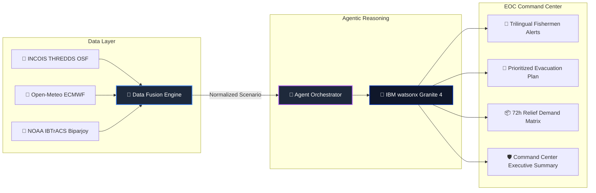
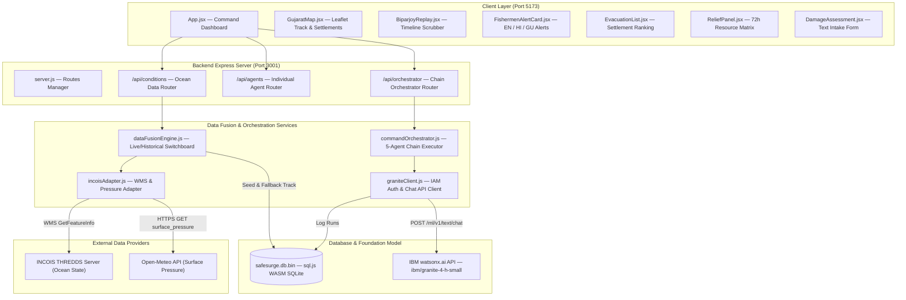
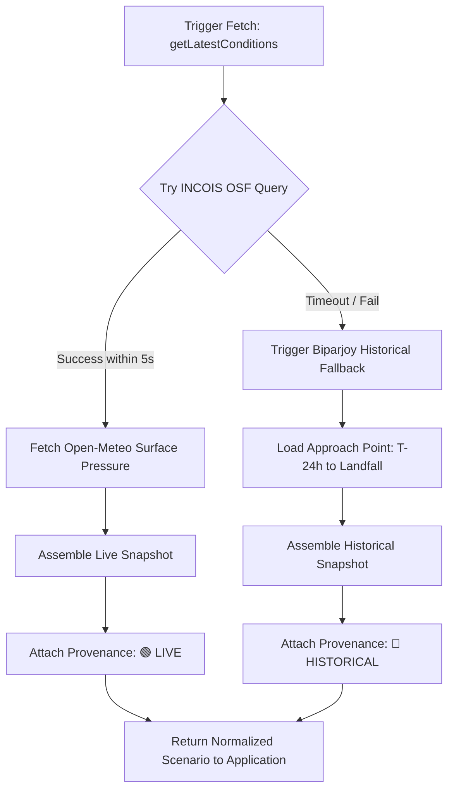
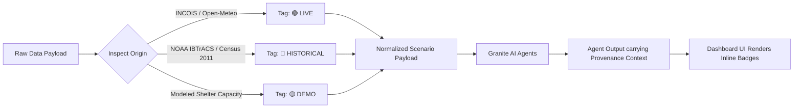
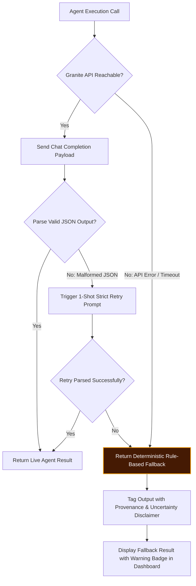

# 🌊 SafeSurge AI

## Agentic Coastal Disaster Intelligence & Response Platform for Gujarat

> **Hyperlocal coastal risk reasoning, trilingual fishermen safety alerts, and automated evacuation & relief coordination powered by IBM watsonx Granite 4.**

---

[](https://nodejs.org/)
[](https://react.dev/)
[](https://www.ibm.com/watsonx)
[](https://incois.gov.in/)
[](https://open-meteo.com/)
[](https://leafletjs.com/)
[](./LICENSE)

---

## ⚠️ Important System Notice & Disclaimer

> **SafeSurge AI is a prototype decision-support platform built for emergency managers and coastal authorities.**  
> AI-generated recommendations, risk levels, and evacuation priorities are intended solely to assist human decision-makers. They do **not** replace official government advisories, IMD cyclone bulletins, or state emergency disaster management orders.

---

## ✨ At a Glance

| Feature | Description | Status / Provenance |
| :--- | :--- | :--- |
| 🟢 **Live Ocean Intelligence** | SWH wave heights, wind speed, directions, and surface currents fetched via THREDDS WMS | 🟢 LIVE / OPERATIONAL |
| 🎈 **Surface Pressure (MSLP Proxy)** | Surface pressure sourced independently from Open-Meteo (`surface_pressure` ECMWF model) | 🟢 LIVE / OPERATIONAL |
| 🤖 **6 Granite AI Agents** | Specialized agents for risk interpretation, multilingual alerts, evacuation, relief, & command summary | 🧠 AI REASONING |
| 🗣️ **Trilingual Safety Alerts** | Concurrent alerts in English, Hindi (Devanagari), and Gujarati (Gujarati script) | 🧠 LIVE AI REASONING |
| 🔵 **Historical Replay** | Track replay of Cyclone Biparjoy (June 2023) from NOAA IBTrACS historical dataset (27 track points) | 🔵 HISTORICAL REAL |
| 🧭 **Evacuation Prioritization** | Rank-ordered settlement evacuations computed from population, elevation, exposure, & shelter capacity | 🧠 AI REASONING |
| 📦 **Relief Coordination** | Automated 72-hour resource demand estimation (food, water, medical teams, rescue boats) | 🧠 AI REASONING |
| 🛡️ **Explicit Data Provenance** | Source data carries provenance tags; derived calculations preserve input provenance context | 🛡️ PROVENANCE-AWARE |

---

# ⚡ SafeSurge in 30 Seconds

SafeSurge AI does **not** ask a Large Language Model to magically predict a cyclone's trajectory or invent weather forecasts.

Instead, SafeSurge enforces a strict engineering principle:

> **"The LLM is NOT the source of truth. Authoritative data is."**

1. **Data Ingestion**: SafeSurge ingests operational ocean forecasts from INCOIS THREDDS endpoints and surface pressure (MSLP proxy) from Open-Meteo.
2. **Normalization & Provenance**: Environmental telemetry is validated, converted to standard units (`km/h`, `m`, `hPa`), and tagged with transparent provenance.
3. **Structured Context Injection**: Clean data snapshots are injected into strict system prompts for specialized IBM Granite 4 LLM agents.
4. **Multi-Agent Chain Orchestration**: Agents run in a dependency-aware hybrid pipeline (sequential interpretation → parallel fishermen & evacuation planning → dependent relief coordination → command center summary).
5. **Operational Decision Support**: Outputs are presented to Emergency Operations Center (EOC) commanders as actionable, human-verifiable dashboards.



---

# 🎯 Why SafeSurge Exists

Gujarat possesses India's longest coastline (**1,600+ km**), highly exposed to severe cyclonic storms originating in the Arabian Sea (e.g., Cyclone Tauktae 2021, Cyclone Biparjoy 2023).

During a rapid cyclonic intensification event:
- **Fishermen at Sea** need direct, clear warnings in their native language (**Gujarati** / **Hindi**) before sea conditions become unsurvivable.
- **District Collectors** must decide which coastal villages (e.g., Jakhau, Mandvi, Dwarka) to evacuate first based on population density, elevation, coastal exposure, and available shelter capacity.
- **Relief Agencies** (NDRF, SDRF) require immediate, accurate 72-hour calculations for food packets, clean water, medical units, and rescue craft.

SafeSurge AI solves these challenges by combining authoritative telemetry with structured AI agent reasoning to eliminate operational decision delays during the critical pre-landfall window.

---

# 📊 Core Capabilities

| Capability | Operational Role | Data Source / Engine | Provenance |
| :--- | :--- | :--- | :--- |
| **Ocean State Telemetry** | Fetches SWH (wave height), wind speed, wind direction, and sea currents | INCOIS THREDDS WMS Server (`osf/ww3`, `osf/winds`) | 🟢 LIVE |
| **Surface Pressure (MSLP Proxy)** | Surface pressure (`surface_pressure`) fetched at offshore coordinates | Open-Meteo API (ECMWF ERA5-seamless) | 🟢 LIVE |
| **Cyclone Track Replay** | Historical 27-point storm track of Cyclone Biparjoy (June 2023) | NOAA IBTrACS NIO Basin Dataset | 🔵 HISTORICAL |
| **Risk Interpretation** | Classifies coastal hazard (`LOW` → `CRITICAL`) based on physical thresholds | Agent 1: `CycloneInterpretationAgent` (Granite 4) | 🧠 AI REASONING |
| **Trilingual Alerts** | Generates tailored safety guidance in English, Hindi, and Gujarati | Agent 2: `FishermenAlertAgent` (Granite 4) | 🧠 AI REASONING |
| **Evacuation Ranking** | Ranks coastal settlements by vulnerability and shelter capacity gap | Agent 3: `EvacuationAgent` (Granite 4) | 🧠 AI REASONING |
| **Relief Logistics** | Computes 72h supplies (food, water, medical, boats) for evacuated populations | Agent 4: `ReliefCoordinationAgent` (Granite 4) | 🧠 AI REASONING |
| **Damage Assessment** | Text-intake scoring & triage of post-disaster structural reports | Agent 5: `DamageAssessmentAgent` (Granite 4) | 🧠 AI REASONING |
| **Command Summary** | Synthesizes all agent outputs into an executive EOC briefing | Agent 6: `CommandOrchestrator` (Granite 4) | 🧠 AI REASONING |

---

# 🏗️ Architecture

SafeSurge AI is built as a decoupled, modular system featuring a **React + Vite frontend**, a **Node.js Express backend**, an embedded **WASM SQLite database**, and an asynchronous client for **IBM watsonx.ai**.



---

# 🌐 Live Intelligence Pipeline

SafeSurge's `dataFusionEngine.js` attempts to query live environmental telemetry at startup and on demand.

### 1. Ocean Telemetry (INCOIS OSF)
- **Source**: Indian National Centre for Ocean Information Services (INCOIS) THREDDS Server.
- **Representative Offshore Coordinate**: `20.5° N, 68.5° E` (Gujarat Sea Area / NE Arabian Sea — offset ~130 km offshore from Porbandar to clear coastal land-masks).
- **Layers Queryed**:
  - `SWH`: Significant Wave Height (metres)
  - `WSM`: Wind Speed Magnitude (m/s → converted to `km/h` and `knots`)
  - `WSXM:WSYM-dir`: Wind Direction (degrees)
  - `SST`: Sea Surface Temperature (°C)
  - `U:V-mag`: Surface Current Speed (m/s → converted to `knots`)

### 2. Surface Pressure (Open-Meteo / MSLP Proxy)
- **Source**: Open-Meteo ECMWF ERA5-seamless API.
- **Variable**: `surface_pressure` (hPa) fetched at `20.5° N, 68.5° E`.
- **Role**: Sourced independently as an atmospheric pressure indicator / MSLP proxy, since INCOIS OSF does not expose atmospheric pressure metrics.

### 3. Live Data Fusion & Fallback Strategy



---

# 🔎 Data Provenance

To preserve absolute trust during emergency operations, SafeSurge AI tags source metrics with transparent provenance badges while preserving input context through AI calculations:

| Provenance Badge | Meaning | System Scope |
| :--- | :--- | :--- |
| 🟢 **LIVE / OPERATIONAL** | Sourced directly from live INCOIS / Open-Meteo operational queries within the last 30s. | Source environmental telemetry. |
| 🔵 **HISTORICAL REAL** | Real historical data from Cyclone Biparjoy (June 2023, NOAA IBTrACS 27-point track) or Census 2011 population records. | Source track points & census data. |
| 🟡 **DEMONSTRATION** | Synthetic or modeled placeholder data (e.g. estimated shelter capacities or scenario overrides). | Synthetic shelter baselines. |
| 🧠 **AI REASONING** | Derived recommendations, priority rankings, and trilingual guidance generated by Granite 4 agents. | Derived AI outputs & logistics matrices. |

> **Provenance Rule**: Source-backed environmental and reference data carry explicit provenance labels (`live`, `historical`, `demo`). Derived AI assessments and deterministic logistics calculations retain the provenance context of their input data.



---

# 🤖 Agentic AI Pipeline

SafeSurge AI utilizes **six specialized agents** powered by `ibm/granite-4-h-small`. Rather than executing sequentially in a slow waterfall, agents execute in an optimized **hybrid parallel topology**.

```mermaid
flowchart TD
    START["Command Center: Run Full Scenario"] --> STEP1["1. Cyclone Interpretation Agent"]
    
    STEP1 -->|Risk Level & Affected Zones| PARALLEL_FORK{"Parallel Execution"}
    
    PARALLEL_FORK --> STEP2["2. Fishermen Safety Alert Agent"]
    PARALLEL_FORK --> STEP3["3. Evacuation Planning Agent"]
    
    STEP2 -->|Trilingual Alerts| JOIN["Join Outputs"]
    STEP3 -->|Settlement Priority Ranks| STEP4["4. Relief Coordination Agent"]
    
    STEP4 -->|72h Supplies & Shortfalls| JOIN
    
    JOIN --> STEP6["6. Command Orchestrator Agent"]
    STEP6 --> END_NODE["Unified Command Center Briefing"]

    INDEP["5. Damage Assessment Agent"] -.->|Runs Standalone on Intake Form| STANDALONE["Post-Disaster Assessment"]

    style STEP1 fill:#1e293b,stroke:#3b82f6,stroke-width:2px
    style STEP2 fill:#1e293b,stroke:#22c55e,stroke-width:2px
    style STEP3 fill:#1e293b,stroke:#eab308,stroke-width:2px
    style STEP4 fill:#1e293b,stroke:#ec4899,stroke-width:2px
    style STEP6 fill:#1e293b,stroke:#a855f7,stroke-width:2px
```



### Summary of Agents

| Agent Name | Route / Endpoint | Primary Responsibility | Execution Mode |
| :--- | :--- | :--- | :--- |
| **Cyclone Interpretation** | `POST /api/agents/interpret-risk` | Contextualizes wind, wave, & pressure metrics into risk levels (`LOW` → `CRITICAL`) | Step 1 (Sequential) |
| **Fishermen Safety Alert** | `POST /api/agents/fishermen-alert` | Generates actionable safety guidance in English, Hindi, and Gujarati | Step 2 (Parallel) |
| **Evacuation Planning** | `POST /api/agents/evacuation-plan` | Ranks coastal settlements by vulnerability, elevation, exposure, & shelter gap | Step 2 (Parallel) |
| **Relief Coordination** | `POST /api/agents/relief-coordination` | Calculates 72-hour supply requirements (food, water, medical, boats) | Step 3 (Sequential) |
| **Command Orchestrator** | `POST /api/orchestrator/run-full-chain` | Main scenario orchestration endpoint (5-agent operational chain; Damage Assessment runs standalone) | Step 4 (Sequential) |
| **Damage Assessment** | `POST /api/agents/damage-assessment` | Scores post-disaster damage from text descriptions (no vision model available) | Standalone (On-demand) |

[👉 Read complete Agent Architecture & Schemas in AGENTS.md](./AGENTS.md)

---

# 🌀 Historical Biparjoy Replay

To allow comprehensive testing even when active cyclones are not present in the Arabian Sea, SafeSurge includes a full **27-point historical replay dataset** for **Cyclone Biparjoy (June 2023)**.

- **Landfall Location**: Near Jakhau Port, Kutch District, Gujarat.
- **Maximum Wind Speed**: 176 km/h (Category 3 Extremely Severe Cyclonic Storm).
- **Interactive Scrubber**: The dashboard timeline scrubber allows emergency managers to replay storm movement step-by-step from deep ocean approach to landfall, observing how Granite agents dynamically alter evacuation rankings as the storm nears shore.

---

# 🛡️ Failure & Fallback Engineering

SafeSurge AI treats system failure as an explicit operational state rather than crashing or swallowing errors.



[👉 Read detailed Architecture & Engineering Decisions in DECISIONS.md](./DECISIONS.md)

---

# 🔒 Security & Environment Setup

SafeSurge AI adheres to strict credential security practices:
- **No hardcoded secrets**: All API keys and credentials are loaded via environment variables in the root `.env` file.
- **Git Ignore Safeguards**: `.env`, `.env.local`, SQLite binary databases, and `node_modules` are explicitly ignored in `.gitignore`.

### Required Environment Variables (`./.env`)

```ini
# IBM watsonx.ai Credentials
WATSONX_PROJECT_ID=your_watsonx_project_id_here
WATSONX_API_KEY=your_watsonx_api_key_here
WATSONX_URL=https://us-south.ml.cloud.ibm.com
WATSONX_MODEL_ID=ibm/granite-4-h-small

# Server Ports
PORT=3001
FRONTEND_PORT=5173
```

---

# 📁 Repository Structure

```text
safesurge-ai/
├── 1-install.bat             # Automated Windows dependency installer
├── 2-start.bat               # One-click startup script (Backend + Frontend + ngrok)
├── 3-stop.bat                # Safe process cleanup script
├── .env.example              # Template environment configuration (copy to .env)
├── .gitignore                # Git exclusions (node_modules, .env, DB binaries)
├── README.md                 # Public landing page & project documentation
├── AGENTS.md                 # Technical specification of AI agent system
├── DECISIONS.md              # Architecture Decision Records (ADRs) & trade-offs
│
├── backend/                  # Node.js + Express backend (Port 3001)
│   ├── server.js             # Express app initialization & route mounting
│   ├── package.json          # Backend dependencies (express, cors, sql.js, dotenv)
│   ├── agents/               # Individual Granite 4 AI Agent implementations
│   │   ├── cycloneInterpretationAgent.js
│   │   ├── fishermenAlertAgent.js
│   │   ├── evacuationAgent.js
│   │   ├── reliefCoordinationAgent.js
│   │   ├── damageAssessmentAgent.js
│   │   └── commandOrchestrator.js
│   ├── services/             # Core business logic & data adapters
│   │   ├── graniteClient.js    # watsonx.ai client with IAM caching & retry logic
│   │   ├── dataFusionEngine.js # Live INCOIS / Open-Meteo & historical fallback switchboard
│   │   └── incoisAdapter.js    # INCOIS THREDDS WMS & Open-Meteo pressure fetcher
│   ├── db/                   # Database layer
│   │   ├── schema.js           # WASM SQLite initialization, schema, & logger
│   │   └── safesurge.db.bin    # Persisted binary SQLite database file
│   ├── data/                 # Static datasets
│   │   ├── biparjoy_track.json # NOAA IBTrACS 27-point track for Biparjoy 2023
│   │   └── settlements.json    # 6 Gujarat coastal settlements (Census 2011)
│   └── routes/               # Express REST API endpoints
│       ├── conditions.js       # Ocean telemetry & track replay endpoints
│       ├── agents.js           # Individual agent execution endpoints
│       ├── orchestrator.js     # Main scenario orchestration endpoint
│       └── settlements.js      # Settlement reference data endpoints
│
└── frontend/                 # React + Vite frontend dashboard (Port 5173)
    ├── package.json          # Frontend dependencies (react, leaflet, vite)
    ├── vite.config.js        # Vite build & proxy settings
    ├── index.html            # HTML entry point with Google Fonts
    └── src/
        ├── main.jsx          # React app entry point
        ├── App.jsx           # Master Command Center dashboard component
        ├── App.css           # Custom dark-theme styling & responsive rules
        ├── api.js            # Axios/Fetch API client wrapper
        └── components/       # UI Dashboard Widgets
            ├── GujaratMap.jsx         # Interactive Leaflet map with storm track
            ├── BiparjoyReplay.jsx     # Timeline scrubber & scenario simulator
            ├── AgentChainPanel.jsx    # Real-time agent reasoning log & status
            ├── FishermenAlertCard.jsx # Trilingual safety alert renderer (EN/HI/GU)
            ├── EvacuationList.jsx     # Prioritized settlement evacuation cards
            ├── ReliefPanel.jsx        # 72h resource demand & mobilization table
            ├── DamageAssessment.jsx   # Text-based post-disaster intake widget
            └── Badges.jsx             # Provenance & risk level badge components
```

---

# 🚀 Quickstart Guide

### Prerequisites
- **Node.js**: v18.0.0 or higher (v24.x tested)
- **npm**: v8.0.0 or higher
- **IBM watsonx.ai Credentials**: API Key & Project ID

### 1. One-Click Windows Setup (Recommended)

1. **Install Dependencies**:
   Double-click `1-install.bat` (installs backend & frontend npm packages).
2. **Configure Credentials**:
   Copy `.env.example` to `.env` in the root folder (`./.env`) and add your IBM watsonx credentials.
3. **Start Application**:
   Double-click `2-start.bat`. This automatically launches the Express backend, starts the Vite frontend, launches an ngrok tunnel (if installed), and opens `http://localhost:5173` in your default browser.
4. **Stop Application**:
   Double-click `3-stop.bat` to safely terminate all background processes.

### 2. Manual Command Line Launch

```bash
# Navigate to project directory
cd safesurge-ai

# Configure environment in root directory
copy .env.example .env
# Edit .env with your IBM watsonx credentials

# Install & start backend
cd backend
npm install
node server.js

# In a separate terminal, install & start frontend
cd frontend
npm install
npm run dev
```

App will be live at `http://localhost:5173`.

---

# 🎬 3-Minute Hackathon Judge Demo Walkthrough

| Time | Demonstration Phase | What to Highlight for Judges |
| :--- | :--- | :--- |
| **00:00 - 00:30** | **System Overview & Live Data** | Point out the live header mode indicator (**🟢 INCOIS OPERATIONAL FORECAST** vs **🔵 HISTORICAL REPLAY**). Highlight provenance badges next to wind, wave height, and Surface Pressure (MSLP proxy). |
| **00:30 - 01:15** | **Run Full Agent Scenario** | Click **⚡ Run Full Scenario**. Point out the right-hand **Agent Reasoning Panel** showing real-time execution progress (Cyclone → Fishermen + Evacuation in parallel → Relief → Command). |
| **01:15 - 01:50** | **Trilingual Fishermen Alerts** | Click the **🎣 Fishermen Alert** tab. Show how Granite 4 generated actionable safety guidance simultaneously in **English**, **Hindi (Devanagari)**, and **Gujarati (Gujarati script)**. |
| **01:50 - 02:25** | **Evacuation & Relief Logistics** | Show **🚨 Evacuation** tab with rank-ordered settlement priority (`IMMEDIATE` → `URGENT` → `PRECAUTIONARY`). Switch to **📦 Relief** tab to view the calculated 72-hour supply requirements and shelter deficits. |
| **02:25 - 03:00** | **Biparjoy Track Replay & Logs** | Drag the **Biparjoy Timeline Scrubber** to simulate landfall at Jakhau. Show how the map updates. Open **🤖 Agent Logs** to show raw execution latencies and database log entries in SQLite. |

---

# 💡 Engineering Highlights

1. **Strict Provenance Tracking**: Data is never silently synthesized or mislabeled. Telemetry is explicitly tagged as `live`, `historical`, or `demo`.
2. **Resilient Data Fusion**: If INCOIS THREDDS endpoints time out (>5s), the platform gracefully degrades to the NOAA IBTrACS Biparjoy dataset without crashing.
3. **Structured Granite Chat API**: Leverages IBM Granite 4 via watsonx `/ml/v1/text/chat` with JSON schema enforcement and automatic single-attempt recovery prompts.
4. **Token-Cached Authentication**: IBM IAM bearer tokens are cached in-memory with a 55-minute TTL, avoiding repeated authentication requests during rapid agent calls.
5. **Zero-Native-Build SQLite**: Uses `sql.js` (WebAssembly SQLite) to store agent logs and settlement seeds without requiring native compilation or C++ toolchains on Windows.

---

# ⚠️ Limitations

- **No Vision Model Capability**: The deployed Granite 4 model (`ibm/granite-4-h-small`) does not support image input. Post-disaster damage assessment operates strictly on structured text descriptions and is clearly labeled as *AI-Generated Text Analysis*.
- **Offshore Sampling Point**: INCOIS THREDDS grid land-masking requires querying an offshore representative coordinate (`20.5° N, 68.5° E`), located ~130 km off Porbandar.
- **Atmospheric Pressure Sourcing**: Atmospheric pressure (surface pressure proxy for MSLP) is not available from INCOIS OSF and is fetched via a secondary integration with Open-Meteo's ECMWF service.

---

# 🔮 Future Roadmap

- [ ] **Multi-Model Fallback**: Add automatic fallback to Granite 3 8B Instruct if Granite 4 endpoints experience high latency.
- [ ] **Multimodal Damage Assessment**: Integrate IBM Granite Vision / VLM endpoints when available to process aerial drone imagery of post-cyclone damage.
- [ ] **WhatsApp / SMS Gateway Integration**: Connect the trilingual alert agent directly to Twilio / Gupshup gateways for automated push broadcasts to registered coastal vessel captains.

---

<p center="align">
  <strong>SafeSurge AI</strong> — Developed for Gujarat Hackathon 2026 (Challenge 6: AI-Driven Cyclone & Coastal Disaster Early Warning System).
</p>
